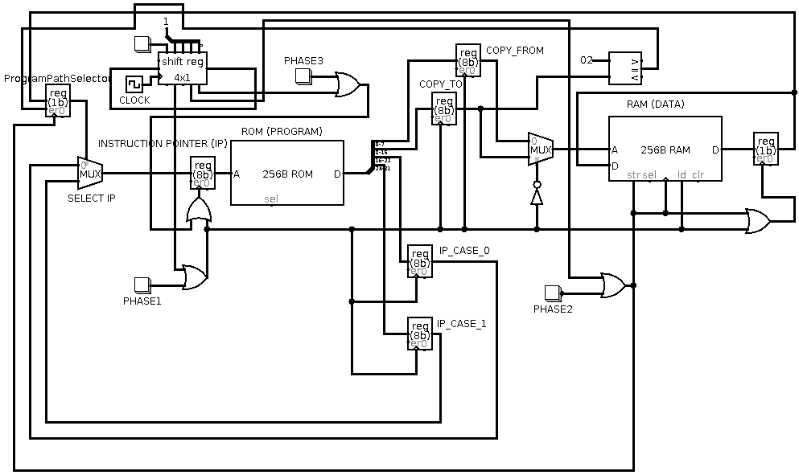
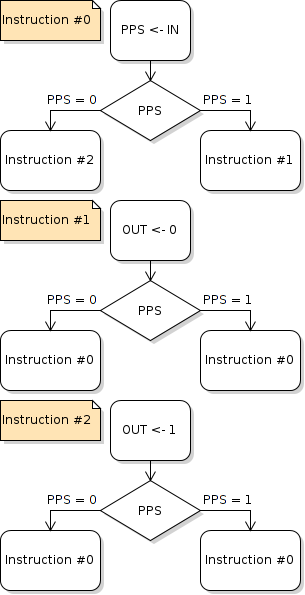

# RESM — Raw Execution-Step Machine

### _aka Bit Bit Jump Jump — a minimal, uniform-instruction-set CPU design_

[](LICENSE)

**RESM** (Raw Execution-Step Machine) is a Turing-complete computer architecture
where every instruction has the same simple format. It is a direct exploration
of the essence of binary computing — inspired by Turing machines and
flow-charts, distilled to the absolute minimum.

> _"Bit Bit Jump Jump"_ — copy a bit, then conditionally jump. That's the entire
> instruction set.

---

## How It Works

Each instruction consists of **four operands** and executes in **three phases**:

| Operand     | Meaning                                 |
| ----------- | --------------------------------------- |
| `COPY_FROM` | Memory address of the source bit        |
| `COPY_TO`   | Memory address where the bit is written |
| `IP_CASE_0` | Next instruction address if PPS = 0     |
| `IP_CASE_1` | Next instruction address if PPS = 1     |

| Phase                     | Action                                                                                                 |
| ------------------------- | ------------------------------------------------------------------------------------------------------ |
| **1. Fetch**              | Read the bit at address `COPY_FROM`                                                                    |
| **2. Copy** ("Bit Bit")   | Write that bit to address `COPY_TO`                                                                    |
| **3. Jump** ("Jump Jump") | Set instruction pointer to `IP_CASE_0` or `IP_CASE_1` based on the **PPS** (Program Path Selector) bit |

The PPS register is memory-mapped at address `0x02` — writing to it controls
program flow. This is the only conditional mechanism and it is sufficient to
achieve **Turing completeness**.

There are no "words" — the machine operates on individual bits, and word sizes
(8, 16, 32, 64-bit, or arbitrary) are composed through sequences of
instructions.

---

## Repository Structure

```
├── docs/
│   └── full-doc.html            # Full documentation (also the GitHub Pages site)
├── LICENSE                      # MIT License
├── circuits_in_logisim/
│   ├── bbjj_cpu.circ            # CPU circuit (open with Logisim-evolution)
│   ├── testing_input_mode.circ  # I/O testing variant
│   ├── rom.txt / ram.txt        # Memory contents for the circuit
│   ├── circuit_schematics.png   # Visual schematic
│   └── README.md                # Logisim-evolution usage notes
├── flowcharts_in_violet/
│   ├── or_gate.activity.violet.html   # OR gate program flowchart
│   ├── not_gate.activity.violet.html  # NOT gate program flowchart
│   ├── flowchart_of_or_gate_program.png
│   ├── flowchart_of_not_gate_program.png
│   └── README.md                # Violet usage notes
└── pcb_in_fritzing/
    └── bit_bit_jump_jump_machine.fzz  # PCB layout (open with Fritzing)
```



---

## Getting Started

### Explore the Hardware Circuit

1. Download **Logisim-evolution** —
   [https://github.com/logisim-evolution/logisim-evolution](https://github.com/logisim-evolution/logisim-evolution) (free, open
   source, cross-platform; maintained fork of the original Logisim)
2. Open `circuits_in_logisim/bbjj_cpu.circ`
3. Load ROM/RAM content from `rom.txt` and `ram.txt`
4. Simulate and observe the CPU executing instructions cycle by cycle

### View Program Flowcharts

1. Download **Violet UML Editor** —
   [https://sourceforge.net/projects/violet/](https://sourceforge.net/projects/violet/)
   (free, open source, cross-platform)
2. Open the `.activity.violet.html` files to explore the flowcharts
   interactively
3. Or view the pre-rendered PNG images directly

### Open the PCB Design

1. Download **Fritzing** — [https://fritzing.org/](https://fritzing.org/)
2. Open `pcb_in_fritzing/bit_bit_jump_jump_machine.fzz`

---

## Software VM Implementations

Several software interpreters and tools are available in separate repositories:

| Language       | Repository                                                      | Features                                                                          |
| -------------- | --------------------------------------------------------------- | --------------------------------------------------------------------------------- |
| **JavaScript** | [copyjump.js](https://github.com/arkenidar/copyjump.js)         | Browser-based VM and tools (web standards)                                        |
| **Python**     | [CopyJumpMachine](https://github.com/arkenidar/CopyJumpMachine) | Parses `*.prg.txt` files; includes a byte-adder program                           |
| **Java**       | [copyjumpvm](https://github.com/arkenidar/copyjumpvm)           | Parses `*.cj` numeric format; converts text → numeric format; quick demo included |

---

## Example Program: NOT Gate

Every program can be represented as a **flowchart** where each instruction is an
assignment (rectangle) followed by a decision (diamond). Here is a NOT gate
implemented in RESM:



---

## Key Ideas & Future Directions

- **Turing Complete** — Any computation can be expressed
- **Micro-code style** — RESM can serve as a lowest-level layer; higher-level
  languages can be compiled to it or interpreted on top of it
- **Multi-core potential** — Many RESM cores running in parallel, synchronized
  by shared phase timing
- **FPGA / ASIC ready** — The design is suitable for hardware synthesis
  (VHDL/Verilog)
- **Genetic programming** — The bit-level granularity enables micro-mutations
  for evolutionary algorithms
- **Self-modifying code** — Programs can rewrite themselves, enabling
  progressive code decompression and runtime optimization
- **Code rewriting & optimization** — The uniform format makes program
  transformation straightforward and granular

---

## Documentation & Links

- 📖 **Full documentation:**
  [arkenidar.github.io/resm_aka_bbjj/docs/full-doc.html](https://arkenidar.github.io/resm_aka_bbjj/docs/full-doc.html)
- 🌐 **Esolangs wiki:**
  [BitBitJump on Esolangs.org](https://esolangs.org/wiki/BitBitJump#Featuring_a_Path_Selector_Bit_.28BBJ_Machine.29)
- 📦 **Download ZIP:**
  [github.com/arkenidar/resm_aka_bbjj/archive/master.zip](https://github.com/arkenidar/resm_aka_bbjj/archive/master.zip)

---

## License

MIT — Copyright (c) 2017 Dario "Raw Coder" Cangialosi. See [LICENSE](LICENSE)
for full text.

---

_"Life is unpredictably short — open the sources."_ `#open_the_sources`
`#memento_mori`
